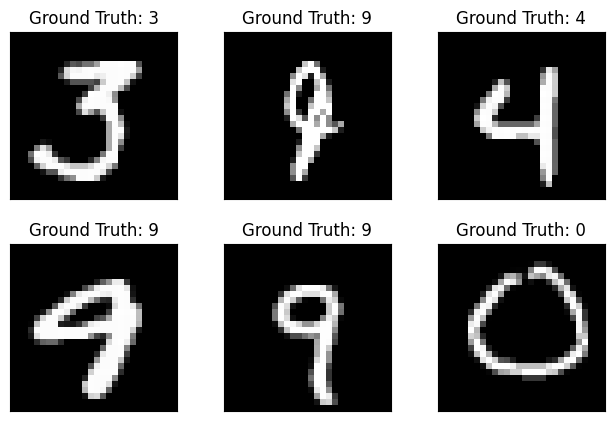

# Handwritten Digit Recognizer using CNN

This repository implements a Convolutional Neural Network (CNN) 
for recognizing handwritten digits from the MNIST dataset using 
PyTorch. The project also includes an interactive UI built with 
the Godot engine that allows users to draw digits and see
real-time predictions performed by the CNN model 
running in the background.


## CNN Model Architecture

The CNN is a simple architecture with the following layers:

- Conv2d layer with 10 filters (kernel size 5) + ReLU + MaxPooling
- Conv2d layer with 20 filters + Dropout2d + ReLU + MaxPooling
- Fully connected layer with 50 units + ReLU
- Dropout + Output fully connected layer with 10 units (one per digit) + LogSoftmax


## Data and Training

- Dataset: MNIST handwritten digits, automatically downloaded and loaded using torchvision.
- Training batch size: 64
- Testing batch size: 1000
- Optimizer: Adam
- Loss function: Negative Log Likelihood Loss (NLLLoss)
- Training epochs: 3
- Training loss and test accuracy are plotted during training (example accuracy on test set: ~97%).


## Using the Godot UI with Real-time Predictions

The Godot engine project in `godot_project/` provides a user interface for interactively drawing digits.

- The UI writes handwritten digit data to a named pipe file `model_input.pipe`.
- The Python script `predict.py` continuously reads from `model_input.pipe`, runs the CNN model prediction, and writes the predictions to `model_output.pipe`.
- This setup allows real-time interaction where the user can see predictions instantly as digits are drawn.


## Setup and Installation

> **Important:**  
> Currently, this project is fully supported only on Linux systems 
> due to its reliance on named pipe (FIFO) files for interprocess
> communication. It may also work on macOS, though this has not
> been tested. Windows support is not yet available,
> but development is underway to extend compatibility to Windows OS.

1. Clone the repository
2. Create a virtual environment and install the dependencies:
    ```sh
    python3.11 -m venv venv
    source venv/bin/activate
    pip install -r requirements.txt
    ```
3. Train the model (optional if you want to retrain):
   - Run `Model_training.ipynb` in Jupyter to train and save the model to `trained_models/model.pth`.

4. Run the prediction server:
   ```sh
   python predict.py
   ```

5. Open the Godot project in Godot Engine 4.5 and edit project from `godot_project/` folder.
   - The UI will interact with `predict.py` via the FIFO pipes for real-time digit recognition.


## Example Digits Recognized


